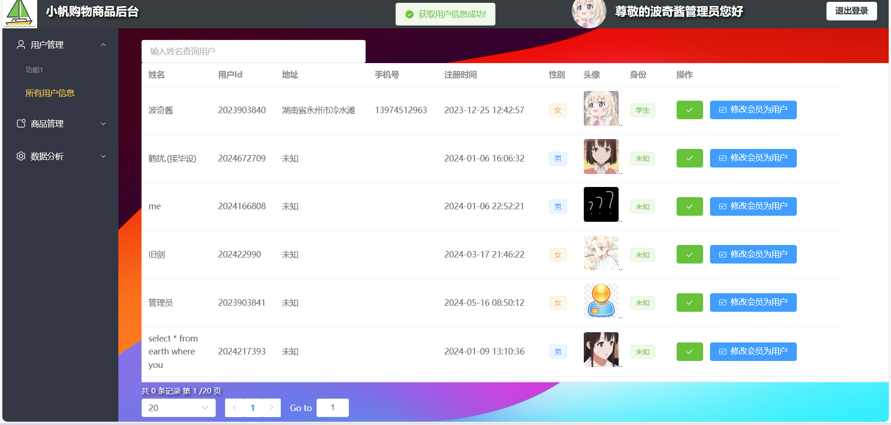
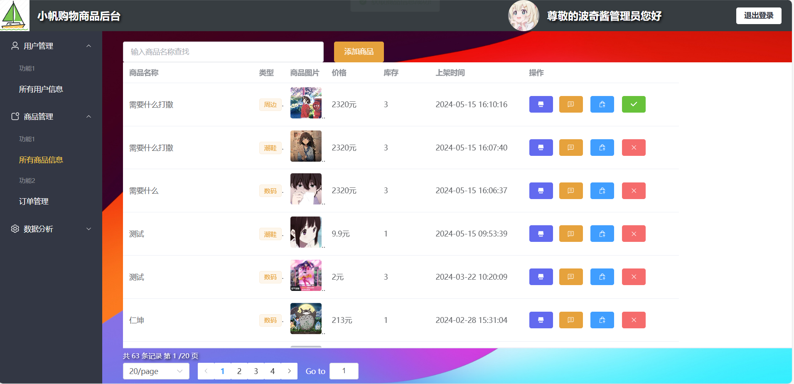
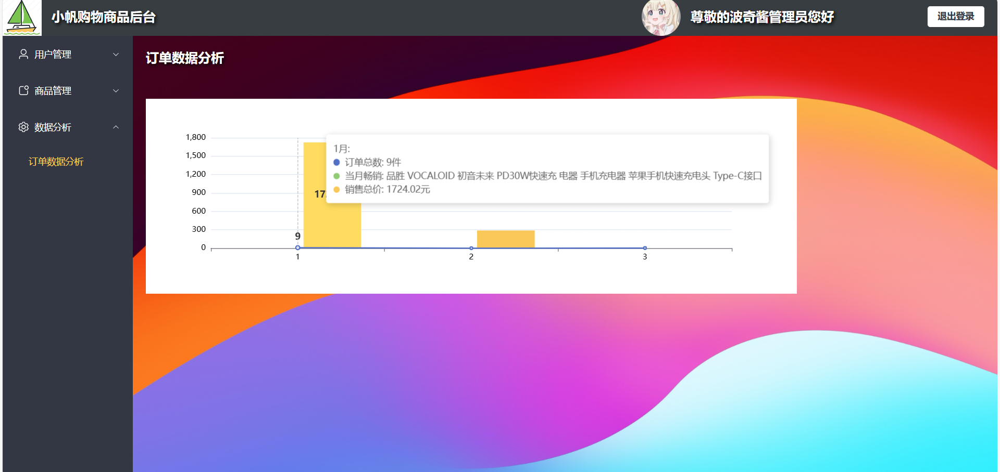

# 小帆商城购物后台

### 后端地址：https://github.com/LF2004/xiaofan-shopping-service
### 前台地址：https://github.com/LF2004/xiaofan-shopping

# 小帆购物使用说明与技术栈

## 使用说明

### 用户列表
### 商品列表
### 订单列表
### 订单分析

## 技术栈

### 前端
- **Element-Plus**：前端组件库。
- **Vue 3**：作为前端框架，提供响应式的数据绑定和组件化开发。
- **Pinia**：Vue 3的状态管理库，用于管理全局状态。
- **Pinia-plugin-persistedstate**：持久化Pinia状态，确保用户数据不丢失。
- **Axios**：用于发起HTTP请求，与后端API接口进行数据交互。

## 页面展示

